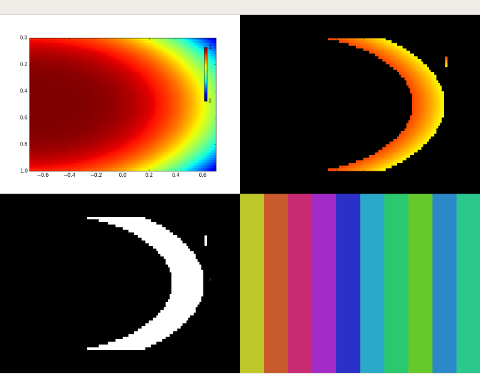

# Color Seperator

## 결과 설명
 * 왼쪽 위 사진이 원본 데이터이고 필요한 범위를 color picker 창에서 지정해 주면  
 * 오른 쪽 위와 같이 원하는 색상이 추출 됩니다  
 * 왼쪽 아래는 추출된 mask 
 * 오른쪽 아래는 추출된 hsv에서 h(색상) 채널의 범위를 나타내고 있습니다
 
 ## 파일 설명
  * CutUIFolder.py
    * 실행 프로그램
    * 두 개의 창이 나타나고 color picker 에서 색을 두 가지 선책함.
    * 선택하여 클릭하면 클릭 이벤트와 함께 화면에 결과나 나타남. 